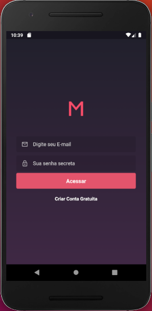
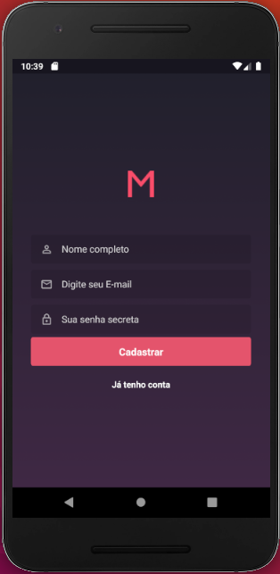
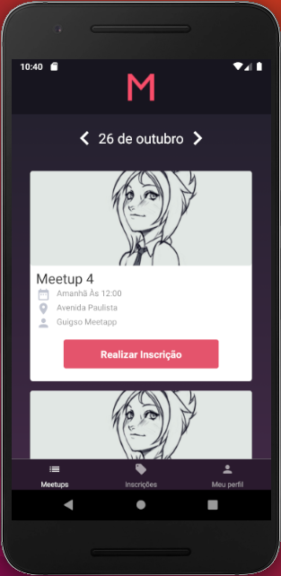
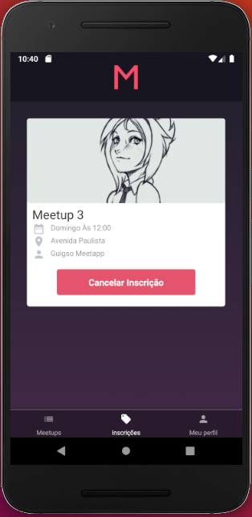
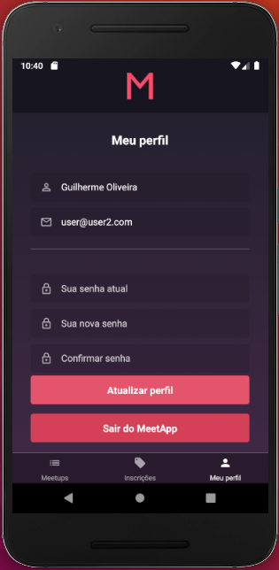
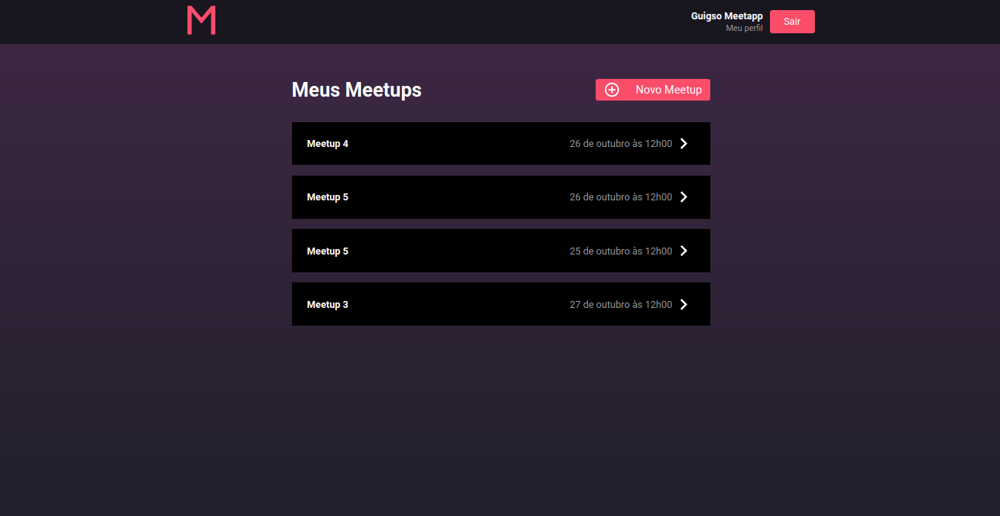
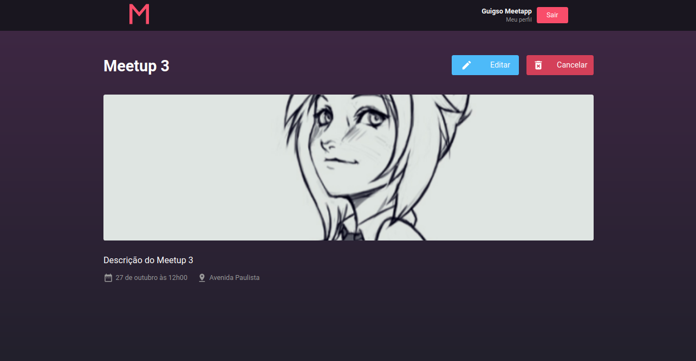
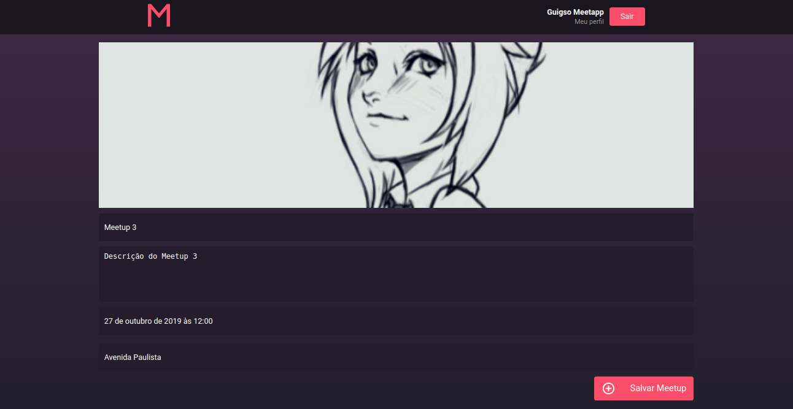
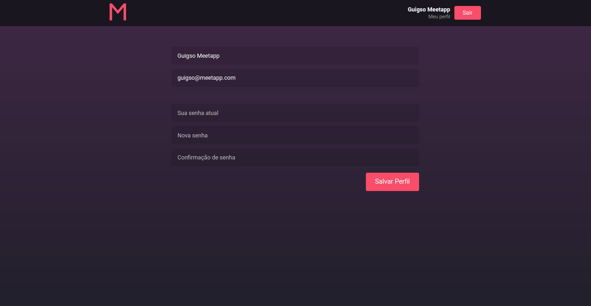

# Description

Application made to Rocketseat GoStack Certification.

Meetapp is an application made to create and manage your own meetups. Later, anyone who likes your meetup purpose can subscribe and participate with you

# Screenshots

# 

### 

### 

### 

### 

### 

### 

### 

## 

<hr/>

# Installation

Requirements:
NodeJS
Yarn
Postgres
Redis

## Application Server

```
$ cd meetapp-backend/

# Install dependencies
$ yarn install

# Run Migration
$ yarn sequelize db:migrate

Make sure you set .env variables (see .env.example)

# Start development server
$ yarn dev

run '$ yarn queue' to use mailing service
```

## WEB Application

```
$ cd meetapp-web/

$ yarn install

# Start development server
$ yarn start
```

## Mobile Application

```
$ cd meetapp-mobile/

# Install dependencies
$yarn install

(Mobile application tested only on Android System)


$ yarn android

# Start development server
$ yarn start
```
